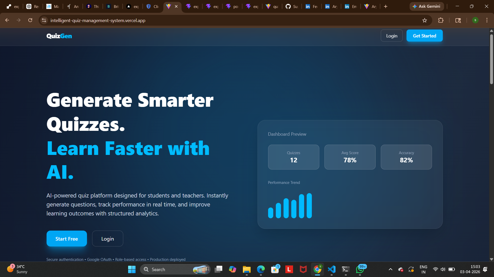
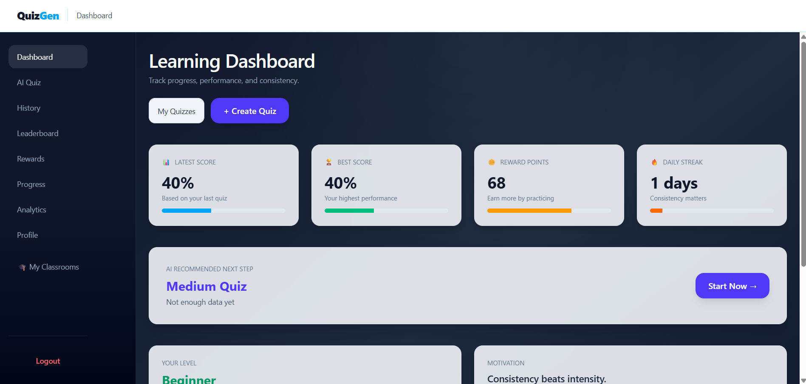
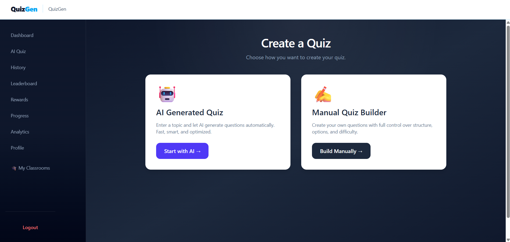
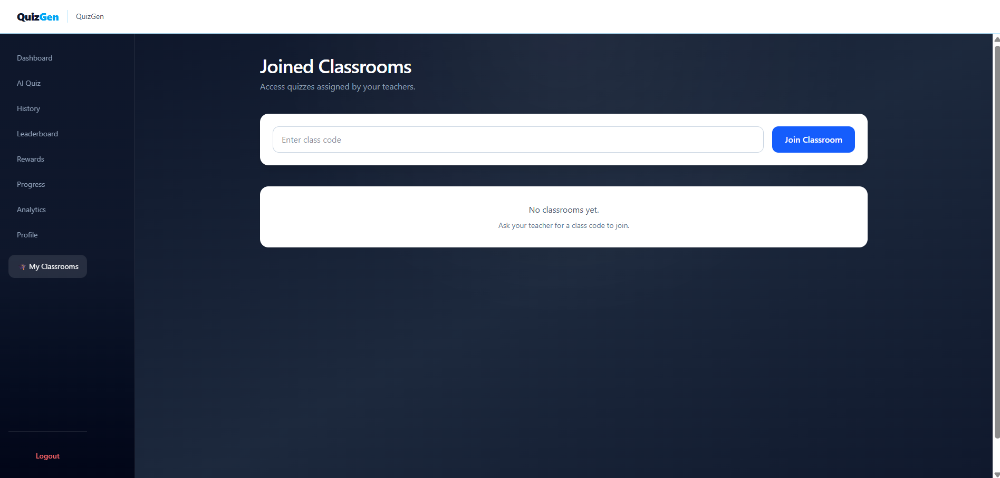
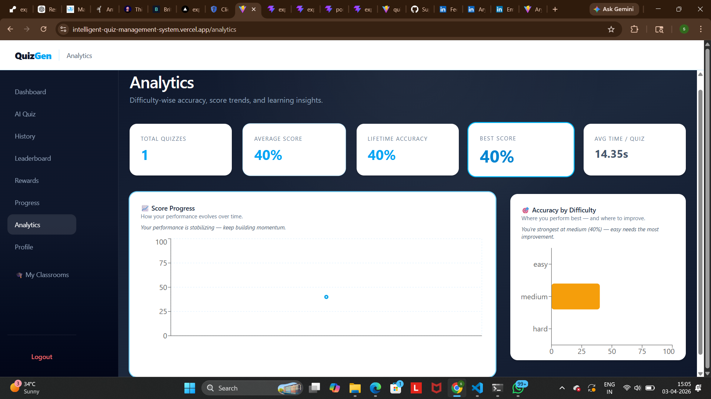
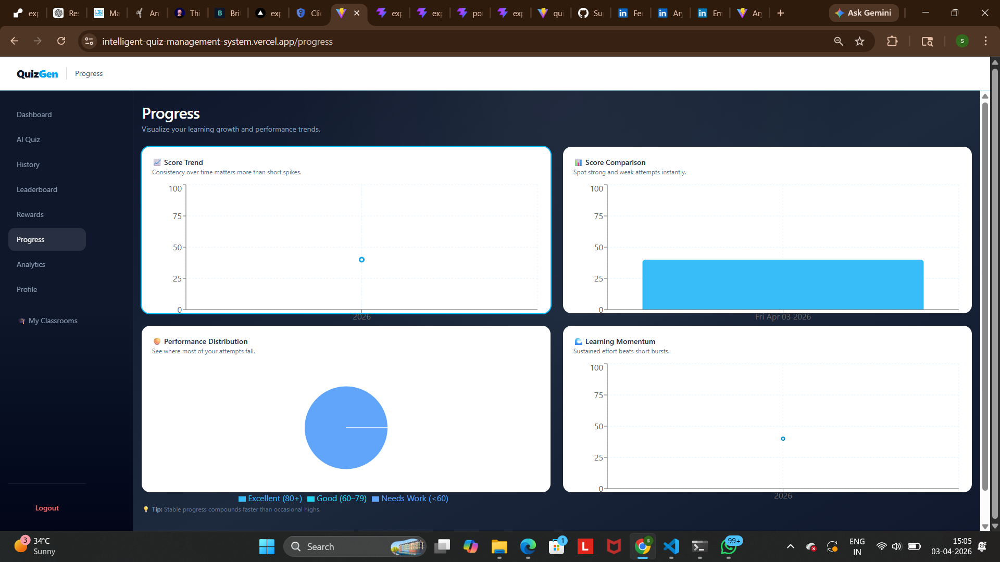
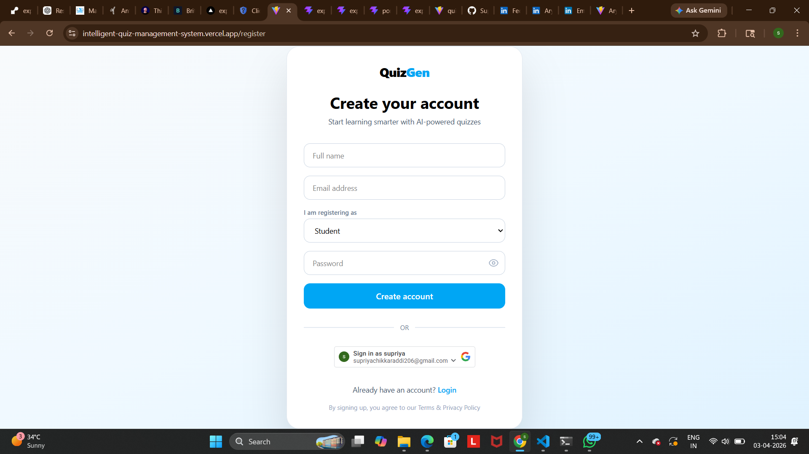

# Intelligent Quiz Management System

Production-deployed full-stack AI-powered learning platform built with Django (Django REST Framework) and React.

Live Demo:
https://intelligent-quiz-management-system.vercel.app

Backend API:
https://intelligent-quiz-management-system.onrender.com

---
## 📸 Screenshots

### 🏠 Landing Page

### 📊 Dashboard

### 🧠 Create Quiz (AI Powered)

### 🏫 Classroom Management

### 📈 Analytics

### 📉 Progress Tracking

### 🔐 Authentication (Register/Login)

## Overview

Intelligent Quiz Management System is a role-based AI-driven learning platform that enables dynamic quiz generation, classroom workflows, performance analytics, and gamified engagement.

The system follows a decoupled frontend–backend architecture and is deployed in a cloud production environment.

Supported roles:
- Student
- Teacher

---

## Core System Design

### Decoupled Architecture

Frontend (React + Vite)
↓
REST API (Django REST Framework)
↓
PostgreSQL Database

The frontend communicates exclusively through RESTful endpoints.  
The backend is stateless and secured using token-based authentication.

---

## Authentication & Authorization Architecture

- Email & Password authentication
- Google OAuth (ID token verification)
- DRF TokenAuthentication (stateless)
- Global `IsAuthenticated` enforcement
- Role-Based Access Control via custom `UserProfile`

### Authentication Flow

1. User authenticates via Email or Google OAuth.
2. Backend verifies credentials or validates Google ID token.
3. DRF generates authentication token.
4. Token stored in frontend.
5. All protected endpoints require Authorization header.

Role restrictions are enforced at the API layer using DRF permission classes.

---

## Data Model & Relational Design

Designed using normalized relational schema in PostgreSQL.

Key relationships:

- `User` ↔ `UserProfile` (OneToOne)
- `Classroom.teacher` → User (ForeignKey)
- `Classroom.students` ↔ User (ManyToMany)
- `Quiz.created_by` → User (ForeignKey)
- `Attempt.user` → User (ForeignKey)
- `Attempt.quiz` → Quiz (ForeignKey)
- Reward and analytics models linked via ForeignKey relationships

This structure supports:

- Classroom ownership
- Student enrollment tracking
- Attempt lifecycle management
- Performance aggregation
- Reward system consistency

Database constraints and relational integrity ensure consistent state transitions across quiz attempts.

---

## AI Integration Pipeline

Integrated GROQ API for dynamic quiz generation.

Workflow:

1. User submits topic, difficulty, question type.
2. Backend constructs structured AI prompt.
3. AI response validated and parsed.
4. Questions normalized and persisted.
5. Quiz attempt lifecycle initiated.

Validation layer ensures malformed AI responses do not corrupt database state.

---

## Core Functional Workflows

### Student Flow
- Generate AI-based quizzes
- Start attempt
- Submit responses
- Receive evaluation
- View analytics dashboard
- Track difficulty progression

### Teacher Flow
- Create manual quizzes
- Create and manage classrooms
- Assign quizzes to students
- Monitor participation

---

## Technical Highlights

- Modular architecture with 6 Django apps
- 30+ REST endpoints with structured separation
- Stateless API design with token authentication
- Custom RBAC implementation
- Relational database modeling with OneToOne, ForeignKey, ManyToMany
- Secure cross-origin production deployment (Vercel ↔ Render)
- Axios interceptors for automatic token injection
- OAuth ID token verification using Google public keys
- Structured quiz attempt lifecycle (generate → attempt → evaluate → analyze)

---

## Scale & Engineering Complexity

- Multi-role system with permission isolation
- Cross-domain secure deployment with HTTPS proxy headers
- Integrated third-party OAuth + AI API
- Production database configuration
- Environment-based secret management
- Enforced API-level authentication defaults

---

## Tech Stack

Frontend:
- React (Vite)
- Tailwind CSS
- React Router
- Axios
- Google OAuth

Backend:
- Django
- Django REST Framework
- TokenAuthentication
- PostgreSQL
- Google OAuth verification
- GROQ AI API integration

Deployment:
- Frontend: Vercel
- Backend: Render
- Database: Managed PostgreSQL

---

## Local Setup

Backend:

git clone <repo-url>
cd intelligent-quiz-management-system
pip install -r requirements.txt
python manage.py migrate
python manage.py runserver

Frontend:

cd quiz-frontend
npm install
npm run dev

---

## Environment Configuration

Backend `.env` variables:

DJANGO_SECRET_KEY=your-secret-key  
DJANGO_DEBUG=False  
DJANGO_ALLOWED_HOSTS=your-domain.com  

POSTGRES_DB=intelligent_quiz  
POSTGRES_USER=postgres  
POSTGRES_PASSWORD=your-db-password  
POSTGRES_HOST=localhost  
POSTGRES_PORT=5432  

GROQ_API_KEY=your-groq-api-key  

GOOGLE_CLIENT_ID=your-google-client-id  
GOOGLE_CLIENT_SECRET=your-google-client-secret  

---

## What This Project Demonstrates

- Full-stack system architecture
- REST API design and permission control
- OAuth integration and token validation
- Relational database modeling
- AI integration in production workflows
- Secure cloud deployment configuration
- Stateless authentication strategy
- Modular backend application design

---

## Future Improvements

- JWT migration for scalable authentication
- AI response caching layer
- Advanced analytics visualization
- Admin-level moderation panel
- Rate limiting for AI endpoints

---

## Author

Supriya Chikkaraddi
